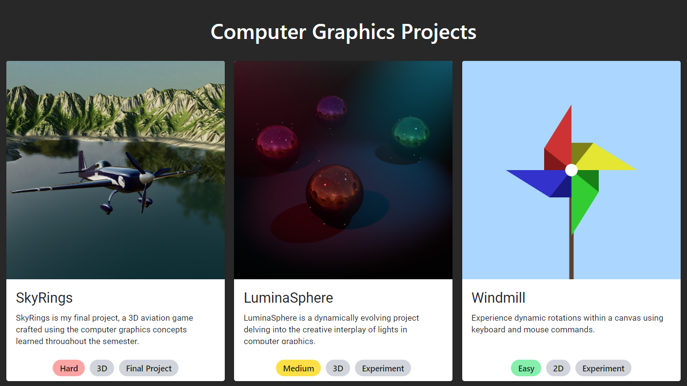

# Computer Graphics Projects

## Table of Contents
- [Author](#author)
- [Description](#description)
- [Technologies](#technologies)
- [Project Preview](#project-preview)
- [Contribution](#contribution)
- [Credits](#credits)
- [License](#license)

## Author
- [Matheus Silva](https://www.github.com/matheuxito) | [LinkedIn](https://www.linkedin.com/in/matheuxito/)

## Description
This repository showcases a series of captivating Computer Graphics projects developed for the UNIFESP (Universidade Federal de São Paulo) course, led by Profª. Dra. Ana Luísa. Leveraging the power of WebGL and Three.js, these projects explore the immersive world of 3D graphics, offering a hands-on experience with cutting-edge web-based technologies. Each project delves into various aspects of computer graphics, providing a comprehensive understanding of topics covered throughout the course.

## Technologies
The projects in this repository utilize WebGL and Three.js for rendering 3D graphics in the web browser. WebGL, a JavaScript API for rendering interactive 2D and 3D graphics, combined with the capabilities of Three.js, a popular 3D library, empowers these projects with efficient and visually stunning graphics. This choice of technologies not only aligns with industry standards but also provides an engaging and accessible platform for students to explore the exciting field of computer graphics.

## Project Preview

*Click on the image to visit the project.*

## Contribution
Contributions are welcome! If you would like to contribute to this repository, please follow these guidelines:
- Fork the repository
- Create a new branch
- Make your changes
- Submit a pull request

## Credits
For details on the credits and attributions for external resources used in these projects, refer to [CREDITS](CREDITS.md).

## License
[MIT](LICENSE) © Matheus Silva